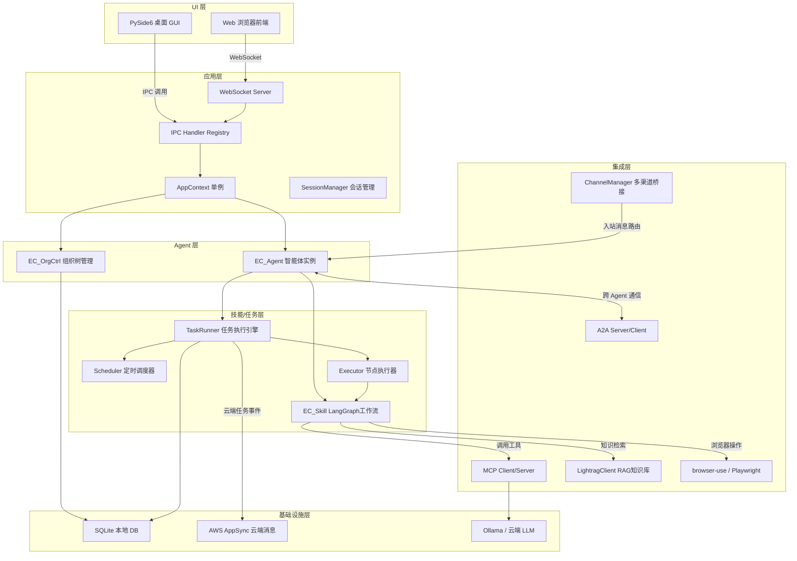
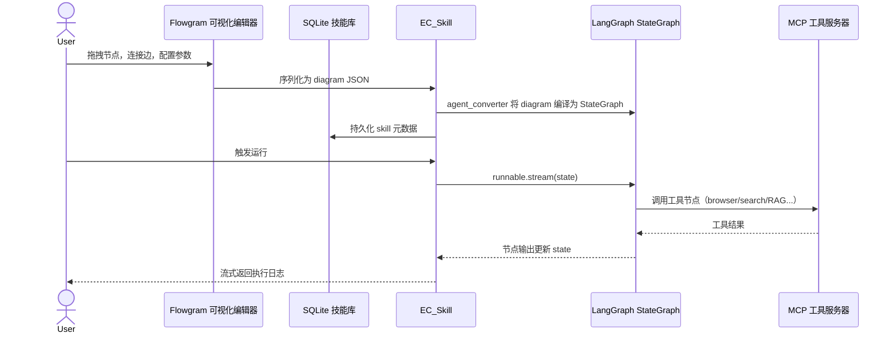
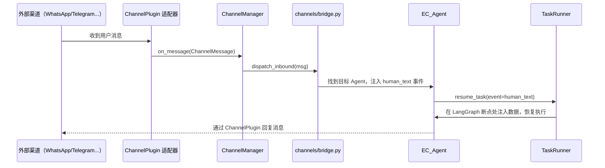
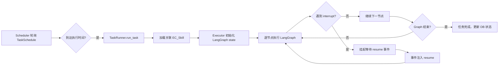
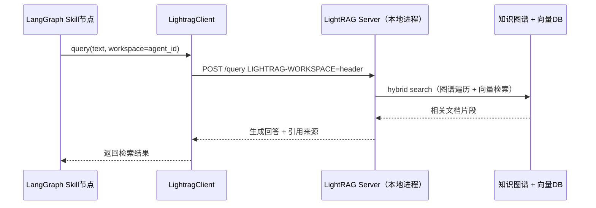
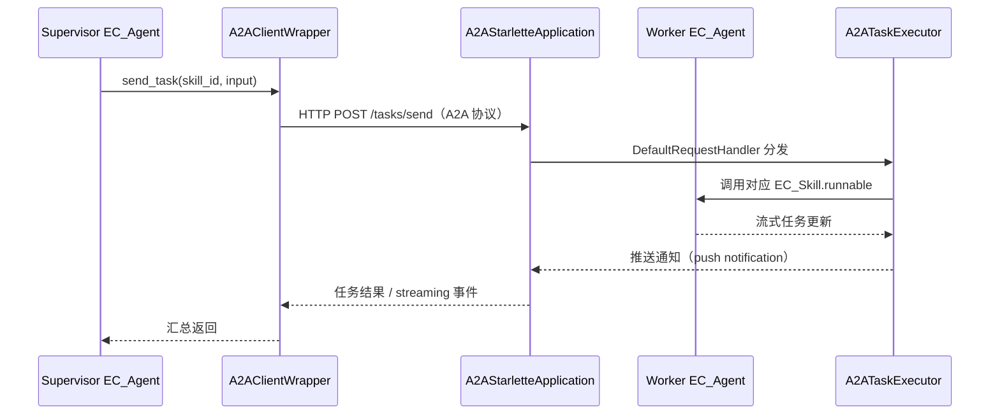

# eCan.ai 项目面试快速复习文档

> 基于真实源码提炼，用于技术面试口述备稿。

---

## 1. 项目简介

### 项目定位与业务背景

**eCan.ai**（E-Commerce Agent Network）是一款 **AI 原生、隐私优先、跨平台** 的电商多智能体应用。目标是让卖家用 AI Agent 自动化运营跨境/多平台电商，从商品采购、营销研究、广告投放到客服回复，全流程用 Agent 替代人工。

### 核心解决痛点

| 痛点 | 解法 |
|---|---|
| 电商操作高度碎片化，人工维护多平台成本高 | 内置多角色 Agent（客服/营销/采购/RPA），可按业务编排工作流 |
| LLM 调用会暴露商业数据 | 支持 Ollama 本地部署模型，提供数据过滤器 |
| 工作流开发需要写代码 | 集成 Flowgram 可视化编辑器，无代码拖拽生成 LangGraph 工作流 |
| 多渠道消息分散（WhatsApp/微信/钉钉等） | 统一 Channel 层接收分发，支持 9+ 通讯渠道 |

### 技术栈与选型理由

| 组件 | 选型 | 理由 |
|---|---|---|
| **GUI 框架** | PySide6（Qt） | 跨平台原生 UI，可打包 Win/Mac/Linux 客户端 |
| **Web 模式** | FastAPI + WebSocket | 无头部署，浏览器作为前端 |
| **AI 框架** | LangGraph（LangChain 生态） | 有向状态图驱动工作流，支持断点/暂停/恢复 |
| **浏览器自动化** | browser-use + Playwright + crawl4ai | 覆盖 AI 驱动和传统 RPA 两类场景 |
| **RAG** | LightRAG | 知识图谱 + 向量检索双模式，召回质量优于纯向量方案 |
| **Agent 通信协议** | A2A（Agent-to-Agent Protocol） | Google 主导的开放协议，标准化 Agent 间 Task 传递 |
| **工具协议** | MCP（Model Context Protocol） | 统一 LLM 工具调用接口，Anthropic 主导标准 |
| **本地 DB** | SQLite | 桌面应用零依赖持久化 |
| **云端消息** | AWS AppSync（GraphQL Subscriptions） | 实时推送任务事件到移动端/Web 端 |

---

## 2. 顶层系统架构

**各层职责**

- **UI 层**：PySide6 桌面客户端或浏览器通过 WebSocket 接入；两种模式共用同一套 IPC 处理逻辑。
- **应用层**：`AppContext` 全局单例持有所有核心对象引用；`IPCHandlerRegistry` 统一注册同步/异步处理器。
- **Agent 层**：`EC_Agent` 是 Agent 的核心实体（扩展自 `browser_use.Agent`），携带技能列表和任务列表；`EC_OrgCtrl` 管理 Agent 组织架构。
- **技能/任务层**：`EC_Skill` 封装 LangGraph `StateGraph`；`TaskRunner` 驱动任务生命周期，支持调度、中断、恢复、取消。
- **集成层**：通过 MCP 对接 LLM 工具；A2A 协议实现跨机器 Agent 通信；`ChannelManager` 统一管理外部消息渠道。
- **基础设施层**：SQLite 本地持久化；AWS AppSync 用于云端实时消息推送；支持本地（Ollama）或云端 LLM。

---

## 3. 核心模块

| # | 模块名称 | 路径 | 核心职责 |
|---|---|---|---|
| 1 | **EC_Agent** | `agent/ec_agent.py` | Agent 实体；持有 skills/tasks，封装 A2A 消息收发，继承 browser_use.Agent 获得浏览器控制能力 |
| 2 | **EC_Skill** | `agent/ec_skill.py` | 技能实体；包装 LangGraph `StateGraph` + `CompiledStateGraph`，持有 MCP 客户端和映射规则 DSL |
| 3 | **TaskRunner** | `agent/ec_tasks/runner.py` | 任务执行核心（383KB 最大文件）；管理任务生命周期、断点恢复、事件驱动 resume、AppSync 云端事件 |
| 4 | **ChannelManager** | `agent/channels/channel_manager.py` | 多渠道插件生命周期管理；按配置启动 WhatsApp/Telegram 等 ChannelPlugin，指数退避重启，统一入站消息路由 |
| 5 | **LightragClient** | `knowledge/lightrag_client.py` | RAG 知识库客户端；代理 LightRAG HTTP API，支持多工作空间（tenant），知识检索用于生成回复 |
| 6 | **AppContext** | `app_context.py` | 全局单例（Metaclass 实现）；持有 Qt App/MainWindow/Logger/Config/ThreadPool 等全局对象，提供 `RunContext` 给外部 Skill 使用 |
| 7 | **EC_OrgCtrl** | `agent/ec_org_ctrl.py` | 组织树管理器；CRUD 组织层级与 Agent 绑定关系，构建带 Agent 计数的树形结构 |

---

## 4. 核心业务流程

### 4.1 技能创建与执行流程

**流程说明**

技能（Skill）是 eCan.ai 中 Agent 执行工作的最小单元，本质是一个 **LangGraph 有向状态图**（StateGraph）。

- **创建阶段**：用户在 Flowgram 可视化画布上拖拽节点（LLM 节点、工具节点、条件分支节点等），系统将画布状态序列化为 `diagram JSON`，由 `agent/agent_converter.py` 编译为真正的 LangGraph `StateGraph` 并存入 `EC_Skill.work_flow`。完成后元数据写入 SQLite。
- **执行阶段**：调用 `EC_Skill.runnable.stream(state)` 启动图执行。每个节点实际上是一个 Python 函数或 MCP 工具调用。LangGraph 按有向边拓扑顺序推进节点，每个节点输出会 merge 回全局 `State` 对象，下一个节点可以读到上游结果。整个执行过程以 **流式（stream）** 方式向上层吐出节点输出，便于实时展示日志。
- **工具调用**：节点需要调用外部能力（搜索/浏览器/RAG）时，通过 MCP 协议（`agent/mcp/local_client.py` 的 `mcp_call_tool`）转发给对应 MCP 服务器，结果返回后继续图执行。

---

### 4.2 多渠道消息接收与 Agent 路由

**流程说明**

这条链路描述的是 Agent 如何响应外部用户（买家/客户）从各渠道发来的消息。

- **消息接入**：每个外部渠道（WhatsApp、Telegram、微信等）对应一个 `ChannelPlugin` 适配器，运行在独立线程中持续监听。收到消息后统一包装成 `ChannelMessage` 对象上报给 `ChannelManager`。`ChannelManager` 负责插件的启动/停止/崩溃重启，不处理业务逻辑。
- **消息路由**：`ChannelManager` 调用注册的 `on_message` 回调，消息进入 `bridge.py` 的 `dispatch_inbound()`。Bridge 根据消息中的渠道 ID / 用户 ID 找到负责该对话的 `EC_Agent` 实例。
- **注入 & 恢复**：找到 Agent 后，将消息内容包装成 `human_text` 事件注入到该 Agent 正在等待中的 LangGraph 任务。LangGraph 工作流在等待人工输入的节点（`interrupt` 断点）处被唤醒，`TaskRunner` 读取事件数据写入 state，图从断点处继续向下执行，最终生成回复。
- **回复发出**：Agent 执行完成后调用 `ChannelPlugin` 的发送接口，把回复推回原渠道。整个过程对 LangGraph 工作流透明——工作流只需在节点里读写 `state.attributes.human.last_message`，无需关心消息来自哪个渠道。

---

### 4.3 定时任务调度执行

**流程说明**

这条链路描述任务如何从"到时间了"变成"执行完毕"，重点在于 **挂起/恢复** 机制。

- **调度触发**：`Scheduler`（`agent/ec_tasks/scheduler.py`）以轮询方式检查 `ManagedTask.schedule`（支持 cron 表达式和一次性时间点），到点后调用 `TaskRunner.run_task()`。
- **初始化执行**：`TaskRunner` 加载 Agent 关联的 `EC_Skill`，由 `Executor` 准备初始 LangGraph `State`（包含任务参数、MCP 客户端等），然后开始流式执行图节点。
- **遇到 interrupt（挂起）**：LangGraph 图中可以用 `interrupt()` 在节点处主动暂停，等待外部事件（如等用户填表、等审批、等浏览器弹窗）。挂起时当前 state 被 checkpoint（序列化存储），任务线程进入阻塞等待。
- **事件驱动恢复**：外部事件（来自渠道消息、GUI 操作、AppSync 云端推送等）到达后，`resume.build_node_transfer_patch()` 计算需要更新的 state 字段差量（patch），`TaskRunner` 将 patch 注入 LangGraph checkpoint，图从断点处继续执行。
- **完成**：图走到 `END` 节点后，`TaskRunner` 更新 SQLite 中任务状态为 `completed`，并通过 `TaskProgressBus` 通知 UI 刷新。

---

### 4.4 RAG 知识库查询流程

**流程说明**

RAG（检索增强生成）让 Agent 能基于业务私有数据（产品手册、政策文件、FAQ 等）回答问题，而非单纯依赖 LLM 训练知识。

- **调用方式**：当 LangGraph 工作流的某个节点需要查询知识库时，通过 MCP 工具或直接调用 `LightragClient.query(text, workspace=agent_id)` 发起检索。`workspace` 实现多租户隔离——不同 Agent 可以有各自独立的知识库。
- **HTTP 代理**：`LightragClient`（`knowledge/lightrag_client.py`）是一个 HTTP 客户端，把查询请求代理给本地运行的 LightRAG 服务进程（默认 `127.0.0.1:9621`）。请求头带 `LIGHTRAG-WORKSPACE` 指定工作空间，LightRAG 服务端据此路由到正确的数据集。
- **混合检索**：LightRAG 服务内部同时维护**知识图谱**（实体关系）和**向量数据库**，执行 hybrid search——既做向量相似度召回，也做图谱实体遍历，比纯向量方案在结构化知识（如产品属性关系）上召回质量更高。
- **结果返回**：LightRAG 把检索到的文档片段组织成自然语言回答后返回，`LightragClient` 将结果透传给调用节点，节点把答案写入 state 供后续节点（如 LLM 节点）使用。

---

### 4.5 A2A 跨 Agent 任务委托

**流程说明**

A2A（Agent-to-Agent）是 eCan.ai 实现多机 Agent 协作的核心机制，让一个 Agent 像调用 API 一样把子任务委托给另一个 Agent。

- **身份标识**：每个 `EC_Agent` 在初始化时持有一张 `AgentCard`（包含 Agent ID、能力描述、支持的 Skill 列表），通过 `A2AStarletteApplication` 暴露 HTTP 服务端点（`/tasks/send`、`/.well-known/agent.json` 等），供其他 Agent 发现和调用。
- **任务委托**：Supervisor Agent 决定把某个子任务分包出去时，通过自身持有的 `A2AClientWrapper` 向 Worker Agent 的 HTTP 端点发送 A2A 标准格式的 `POST /tasks/send` 请求，请求体包含 skill_id 和输入数据。
- **Worker 端执行**：Worker Agent 的 `A2AStarletteApplication` 收到请求后，由 `DefaultRequestHandler` 路由给 `A2ATaskExecutor`，后者找到对应 `EC_Skill` 并执行 LangGraph 工作流，执行过程中的中间状态通过 push notification 实时推送给 Supervisor。
- **结果汇聚**：Supervisor 端的 `A2AClientWrapper` 以 streaming 方式接收 Worker 的更新事件，最终收到完成信号后将结果写回自身的 LangGraph state，继续 Supervisor 自己的工作流。跨机器场景下，只要 Worker 的 HTTP 端点可达（局域网或互联网），整个流程无需改动代码。

---

## 5. 核心源码梳理

### 5.1 `agent/ec_agent.py` — EC_Agent

**文件路径**：`agent/ec_agent.py`（~39KB）

**核心职责**：eCan.ai 的 Agent 实体，继承自 `browser_use.agent.service.Agent`，叠加了 ManagedTask 任务列表、A2A 消息收发、多技能管理。

**关键逻辑**：
- 构造时接收 `skill_llm`、`tasks: List[ManagedTask]`、`skills: List[EC_Skill]`，以及 `card: AgentCard`（A2A 身份卡片）。
- `active_tasks` 用 `Dict[str, Future]` 追踪并发任务，`task_lock` 保证线程安全。
- A2A 消息发送使用专用 `ThreadPoolExecutor(_a2a_send_executor)` 异步发出，防止阻塞主循环。
- `cloud_based` 标志区分本地/云端执行模式。

**上下游关系**：
- 上游：`agent/agent_converter.py` 的 `convert_dict_to_agent()` 从 DB 数据构造实例。
- 下游：调用 `EC_Skill.runnable`（LangGraph）执行，通过 `A2AClientWrapper` 向外委托任务。

---

### 5.2 `agent/ec_skill.py` — EC_Skill

**文件路径**：`agent/ec_skill.py`（~47KB）

**核心职责**：技能实体，继承自 A2A 的 `AgentSkill`，将 LangGraph `StateGraph` + `CompiledStateGraph` 打包为一个可持久化、可传输的对象。

**关键逻辑**：
- `State` TypedDict 定义 LangGraph 顶层状态（`messages`/`mcp_client`/`input`/`retries`/`resolved`）。
- `DEFAULT_MAPPING_RULE` 定义 DSL 映射规则，控制外部事件（`human_text`/`qa_form`/`notification`）如何写入 LangGraph state 和 resume 字段；`run_mode` 区分 `developing`（宽松映射）和 `released`（严格映射）。
- `_generate_stable_id()`：代码技能用 UUID5（基于名称确定性生成），UI 技能随机 UUID，保证重新加载后 ID 稳定。
- `run_in_cloud` / `hybrid_cloud_mode`：技能级别的云端/本地执行开关。

**上下游关系**：
- 上游：`agent/agent_converter.py` 的 `_convert_dict_to_skill()` 反序列化 DB 数据。
- 下游：`TaskRunner` / `Executor` 调用 `runnable.stream()` 执行；`RunContext.core()` 将 `EC_Skill` 暴露给自定义技能脚本。

---

### 5.3 `agent/ec_tasks/runner.py` — TaskRunner

**文件路径**：`agent/ec_tasks/runner.py`（~383KB，系统最大文件）

**核心职责**：任务全生命周期管理引擎；驱动 LangGraph 节点串行/并发执行，实现断点暂停、事件注入恢复（resume）、取消注册，以及 AWS AppSync 云端事件同步。

**关键逻辑**：
- 每个任务在独立线程中运行，通过 `CancellationRegistry` 注册取消令牌。
- `TaskProgressBus`（发布-订阅总线）广播节点执行进度到 GUI/WebSocket。
- `resume.build_node_transfer_patch()` 计算断点恢复时的状态 diff patch，注入到 LangGraph `interrupt` 点。
- `appsync_pubsub.py` 通过 AWS AppSync GraphQL Subscription 接收云端下发的任务事件，实现跨设备控制。
- `is_app_shutdown_active()` 全局标志：应用退出时停止新任务调度，给运行中任务收尾时间。

**上下游关系**：
- 上游：`EC_Agent` 触发 `run_task()`；`Scheduler` 定时触发；A2A 协议远程触发。
- 下游：调用 `Executor` 执行 LangGraph 节点；向 `TaskProgressBus` 发布事件；通过 `AppSync` 同步到云端。

---

## 6. 面试口述素材

### 6.1 三个技术亮点

**亮点一：可视化 LangGraph 工作流编辑器（Flowgram 集成）**

> 我们把字节跳动开源的 Flowgram 编辑器深度定制，用来图形化编写 LangGraph 工作流。用户拖拽节点、连线，系统通过 `agent_converter.py` 将画布 JSON 双向编译成 LangGraph StateGraph。甚至支持在画布上直接运行/暂停/单步执行，可以给任意节点打断点，暂停后可以查看或修改 LangGraph state 再恢复。这使得非开发人员也能构建复杂的 AI 工作流，极大降低了使用门槛。

**亮点二：多渠道统一消息网关 + 9 种平台接入**

> 通过 `ChannelManager` + `ChannelPlugin` 插件化架构，接入 WhatsApp、Telegram、Slack、微信、钉钉等 9 个渠道。每个渠道插件在独立线程运行，配有指数退避重启策略（最多 5 次重试，延迟 2→4→8→16→32s）。入站消息统一转为 `ChannelMessage` 经 `bridge.dispatch_inbound` 路由到正确的 Agent，Agent 回复同样经渠道插件送出，实现了渠道与业务逻辑的完全解耦。

**亮点三：A2A 协议驱动的分布式 Agent 网络**

> 采用 Google 主导的 A2A（Agent-to-Agent）开放协议，每个 EC_Agent 同时暴露一个 `A2AStarletteApplication` HTTP 服务端和持有一个 `A2AClientWrapper` 客户端。多台机器上的 Agent 可以通过标准 A2A 协议互相委托任务，Supervisor Agent 拆解任务后推给 Worker Agent 执行。结合 AWS AppSync 实时订阅，移动端/Web 端也能远程监控 Agent 执行状态。

---

### 6.2 两个开发难点 + 落地方案

**难点一：ormsgpack Rust 层递归深度限制导致 LangGraph 崩溃**

> LangGraph 用 ormsgpack 序列化 checkpoint 状态，而 ormsgpack 在 Rust 层有 255 层递归上限。当 state 里嵌套了 browser_use 浏览器会话、MCP 客户端对象时，packb 会抛出 `TypeError("Recursion limit reached")`，这不是 Python 异常，原有的 `MsgpackEncodeError` 捕获逻辑不会触发 pickle 回退。
> 
> **解法**：在 `main.py` 的 `_patch_langgraph_checkpoint_serializer()` 里，猴子补丁替换 `JsonPlusSerializer.dumps_typed`，在捕获到含 "Recursion limit" 的 TypeError 时强制走 pickle 序列化路径，同时补丁 `loads_typed` 支持读回 pickle 格式。此补丁在所有 import 之前执行以保证生效。

**难点二：Windows 平台 GBK 编码导致 browser_use 写文件崩溃**

> browser_use 的 `BaseFile.sync_to_disk` 使用 `Path.write_text()` 默认系统编码写文件，Windows 上默认是 GBK。当页面内容包含 emoji 等 Unicode 字符时，直接报 `'gbk' codec can't encode character`。
> 
> **解法**：同样在 `main.py` 中以 `_patch_browser_use_to_utf8()` 猴子补丁替换 `BaseFile.sync_to_disk` 和 `sync_to_disk_sync`，强制所有文件写入使用 `encoding='utf-8'`。还在启动时设置 `os.environ['PYTHONUTF8'] = '1'` 作为全局兜底。

---

### 6.3 系统现存缺陷 + 可行优化方案

**缺陷一：本地 SQLite 无法多机共享**

> 当前所有 Agent/Skill/Task 数据存在单机 SQLite，多台机器（commander + vehicle）之间没有数据同步，只能靠 A2A 协议传递任务，无法共享全局状态。
> **优化方向**：引入轻量级分布式 KV（如 Redis）或者中心化数据库（PostgreSQL），配合 DynamoDB 云端同步，实现跨机器数据一致性。

**缺陷二：runner.py 过于庞大（383KB），维护风险高**

> `agent/ec_tasks/runner.py` 是系统最大文件，几乎所有任务逻辑都塞在这里，职责边界模糊。
> **优化方向**：按职责拆分为 `TaskLifecycleManager`、`LangGraphExecutionEngine`、`CloudEventBridge` 三个独立模块，各自通过接口通信，提升可测试性。

**缺陷三：LightRAG 以独立子进程运行，进程管理脆弱**

> `knowledge/lightrag_launcher.py` 以 subprocess 方式启动 LightRAG 服务，进程崩溃后依赖 `lightrag_health.py` 轮询重启，存在窗口期。
> **优化方向**：改用 supervisord 或内嵌 Python 线程运行 LightRAG 实例，并增加健康检查熔断机制。

---

## 面试 5 分钟速记清单

1. **定位**：AI 原生电商多智能体平台，Agent 自动化运营从采购到客服全流程
2. **核心架构**：Qt 桌面 + WebSocket Web 双模，共用 IPC Handler，AppContext 单例贯穿全局
3. **技能 = LangGraph**：`EC_Skill` 封装 StateGraph，支持断点/暂停/恢复/单步执行
4. **可视化编辑**：集成 Flowgram，双向转换 diagram JSON ↔ LangGraph Python，是核心卖点
5. **任务系统**：`TaskRunner`（383KB）驱动全生命周期，`Scheduler` 支持 cron 定时，A2A 协议支持跨机触发
6. **多渠道**：`ChannelManager` 插件化管理 9 个渠道，独立线程 + 指数退避重启
7. **RAG**：`LightragClient` 代理本地 LightRAG 服务，知识图谱 + 向量双模检索
8. **跨 Agent 通信**：A2A 开放协议，每 Agent 同时是 Server + Client，`A2AStarletteApplication` 暴露 HTTP 端点
9. **最大技术坑**：ormsgpack Rust 层递归限制，猴子补丁强制 pickle 回退（`main.py` 最顶部）
10. **主要缺陷**：SQLite 单机无法多节点共享、runner.py 超大需要拆分、LightRAG 子进程管理脆弱
